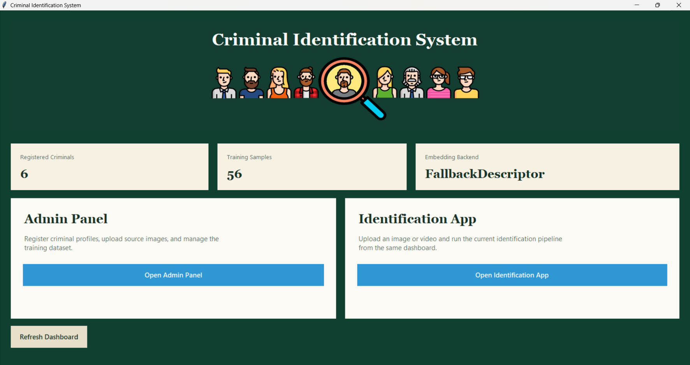
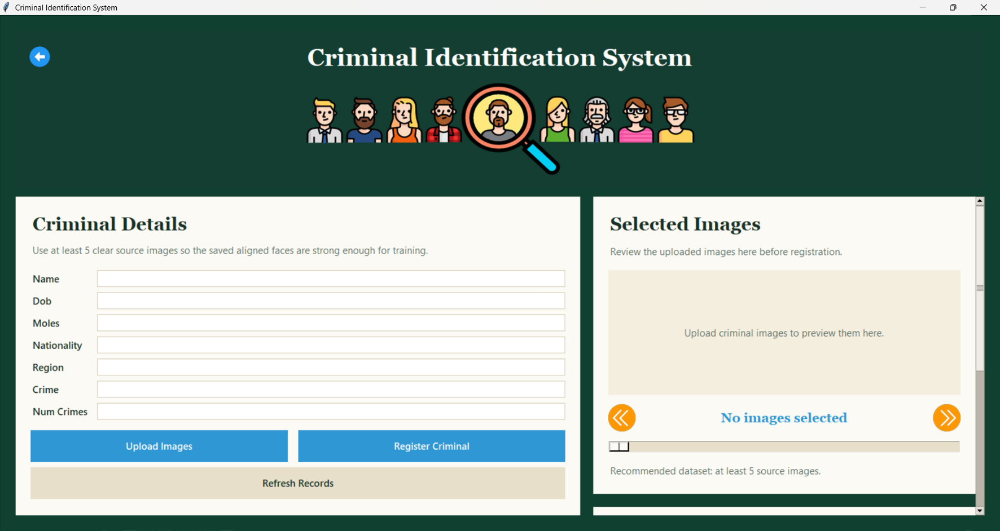
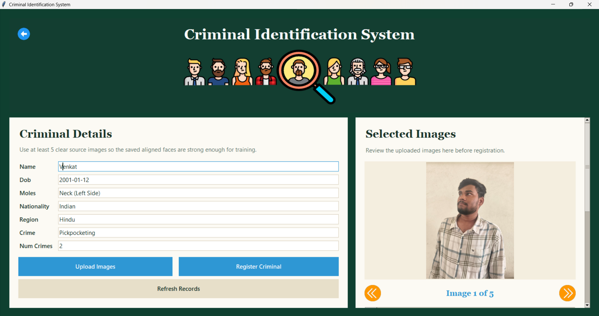
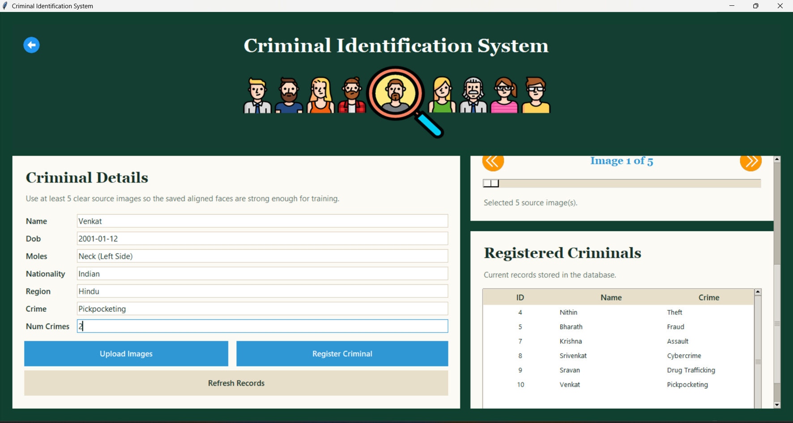
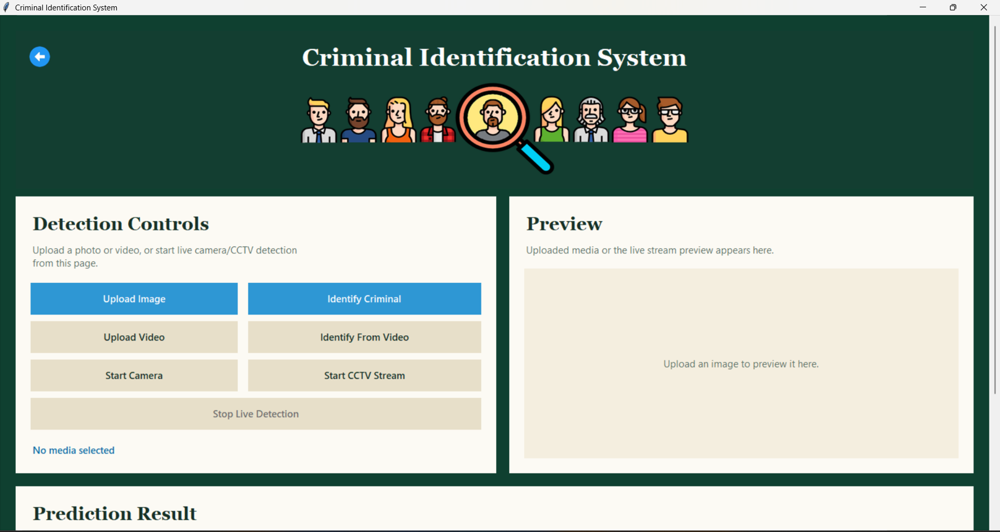
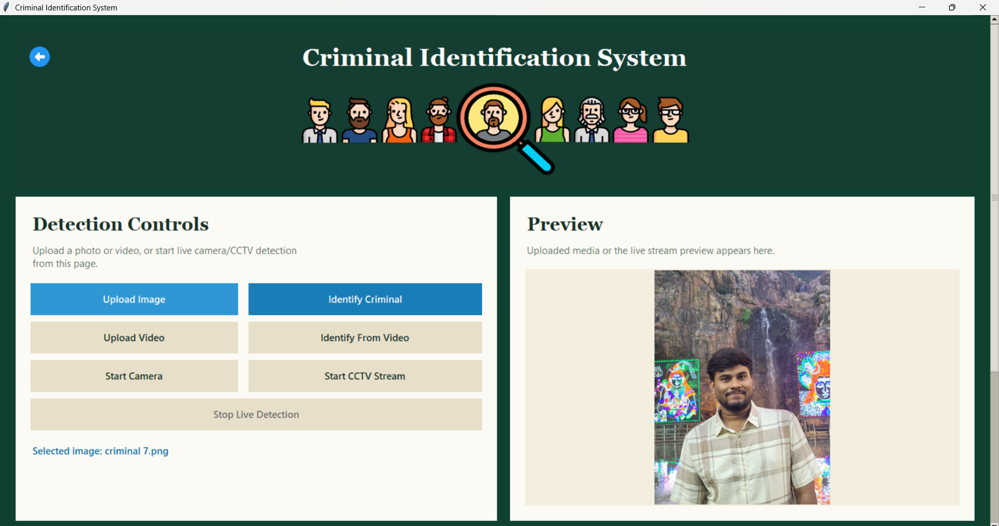
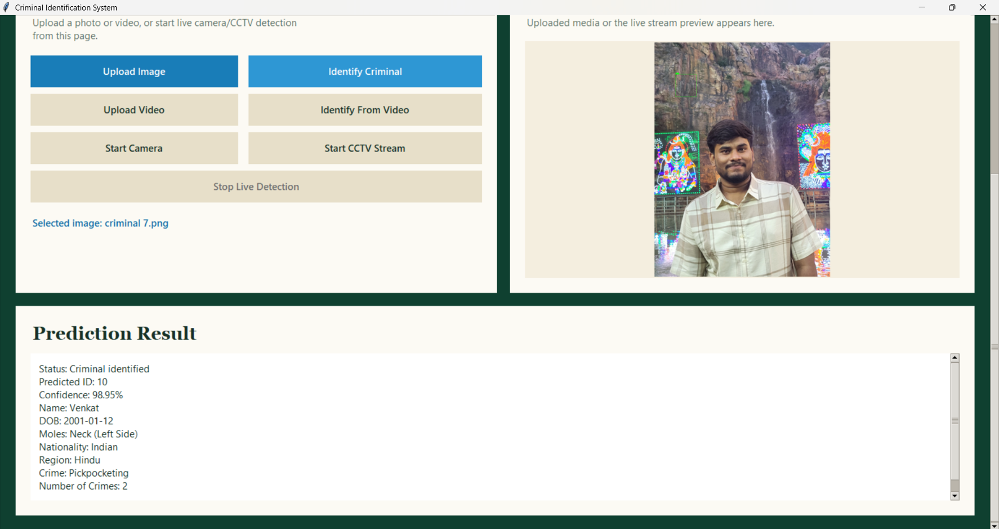

# Criminal Identification System

Major project developed by **Perala Srivenkat** as **Team Lead**.

GitHub: [peralasrivenkat](https://github.com/peralasrivenkat)

## Overview

Criminal Identification System is a Python desktop application that identifies registered criminals from images, videos, camera input, or CCTV streams using face recognition and machine learning. The system supports criminal profile registration, aligned face dataset generation, model training, prediction, database matching, and result display through a Tkinter GUI.

The project was built as a major academic project to demonstrate a complete end-to-end face-recognition workflow for law-enforcement-style identification scenarios.

For the complete file-by-file explanation, workflow details, database tables, algorithms, model artifacts, and resume-ready project description, see [PROJECT_DOCUMENTATION.md](PROJECT_DOCUMENTATION.md).

## My Role

As **Team Lead**, I handled the system design, module coordination, implementation planning, debugging, and integration of the complete workflow from criminal registration to final identification. I also worked on improving the preprocessing, face alignment, embedding extraction, PCA/ACO feature optimization, MLP classification, database connection, and GUI flow.

## Key Features

- Criminal registration with personal and crime details.
- Upload of multiple source images per criminal.
- Face detection using MTCNN with Haar Cascade fallback.
- Face alignment using eye landmarks and orientation correction.
- Preprocessing with RGB conversion, noise removal, contrast enhancement, resizing to `160 x 160`, and normalization.
- `512-D` face embedding extraction using FaceNet support or fallback descriptor extraction.
- Feature scaling using `StandardScaler`.
- Dimensionality reduction using PCA.
- Feature selection using Ant Colony Optimization.
- Classification using MLP Classifier.
- MySQL database integration for criminal records and prediction logs.
- Image, video, camera, and CCTV identification support.
- GUI result display with predicted ID, confidence, and criminal details.
- Unknown-person handling and prediction logging.

## Technology Stack

- **Language:** Python
- **GUI:** Tkinter
- **Computer Vision:** OpenCV, Pillow
- **Face Detection:** MTCNN, Haar Cascade
- **Embedding:** FaceNet-compatible runtime or fallback `512-D` descriptor
- **Machine Learning:** scikit-learn
- **Feature Scaling:** StandardScaler
- **Dimensionality Reduction:** PCA
- **Feature Selection:** ACO
- **Classifier:** MLPClassifier
- **Database:** MySQL
- **Model Persistence:** joblib, JSON
- **Testing:** pytest

## Methodology

```text
Image / Video / Camera Input
        |
        v
Face Detection using MTCNN / Haar Cascade
        |
        v
Face Alignment using eye landmarks
        |
        v
Preprocessing: RGB, denoise, resize 160 x 160, normalize
        |
        v
512-D Face Embedding
        |
        v
Feature Scaling using StandardScaler
        |
        v
PCA Dimensionality Reduction
        |
        v
ACO Feature Selection
        |
        v
MLP Classification
        |
        v
Database Matching
        |
        v
GUI Result Display and Logging
```

## Prototype Workflow

### 1. Dashboard

The dashboard shows the total registered criminals, training sample count, active embedding backend, and navigation to the Admin Panel and Identification App.



### 2. Admin Panel

The Admin Panel is used to enter criminal details and upload training images. The system requires multiple clear source images for reliable model training.



### 3. Criminal Registration

The admin enters name, DOB, identifying marks, nationality, region, crime type, and number of crimes. Uploaded images are previewed before registration.



### 4. Registered Criminal Records

After registration, criminal records are listed in the database-backed table with ID, name, and crime details.



### 5. Identification App

The Identification App supports image upload, video upload, camera detection, and CCTV stream detection.



### 6. Uploaded Test Image

The suspect image is loaded and previewed before running the complete identification pipeline.



### 7. Prediction Result

The system displays the predicted criminal ID, confidence score, name, DOB, identifying marks, nationality, region, crime, and number of crimes.



## Project Structure

```text
Criminal_Identification_System/
|-- config.py
|-- main.py
|-- requirements.txt
|-- database/
|   |-- db_config.py
|   |-- db_connection.py
|   |-- db_operations.py
|   `-- schema.sql
|-- gui/
|   |-- app.py
|   |-- admin_panel.py
|   |-- home.py
|   |-- ui_theme.py
|   `-- assets/
|-- src/
|   |-- preprocessing.py
|   |-- face_detection.py
|   |-- facenet_runtime.py
|   |-- embedding.py
|   |-- pca_module.py
|   |-- aco_module.py
|   |-- classifier.py
|   `-- pipeline.py
|-- models/
|   `-- train_models.py
|-- scripts/
|   `-- repair_face_crops.py
|-- tests/
`-- docs/
    `-- images/
```

## Installation

```powershell
pip install -r requirements.txt
```

Optional packages for advanced detection and real FaceNet inference:

```powershell
pip install mtcnn tensorflow
```

## Database Setup

Update MySQL settings in:

```text
database/db_config.py
```

Then initialize the database:

```powershell
python main.py init-db
```

## Run the Application

Launch the home dashboard:

```powershell
python main.py gui
```

Launch only the admin panel:

```powershell
python gui/admin_panel.py
```

Launch only the identification app:

```powershell
python gui/app.py
```

Train the model:

```powershell
python main.py train
```

Identify from an image:

```powershell
python main.py identify path\to\image.jpg
```

Identify from video:

```powershell
python main.py identify-video path\to\video.mp4
```

## Privacy Note

Training datasets, personal face images, trained model binaries, logs, database files, and unknown-face outputs are intentionally excluded from this repository. This keeps the GitHub project clean and avoids publishing private biometric or generated runtime data.

## Future Enhancements

- Add stronger pretrained FaceNet or ArcFace model support.
- Improve multi-face video tracking.
- Add role-based login for admin access.
- Add cloud deployment support.
- Add analytics dashboard for prediction history.
- Improve unknown-person rejection using larger validation datasets.
